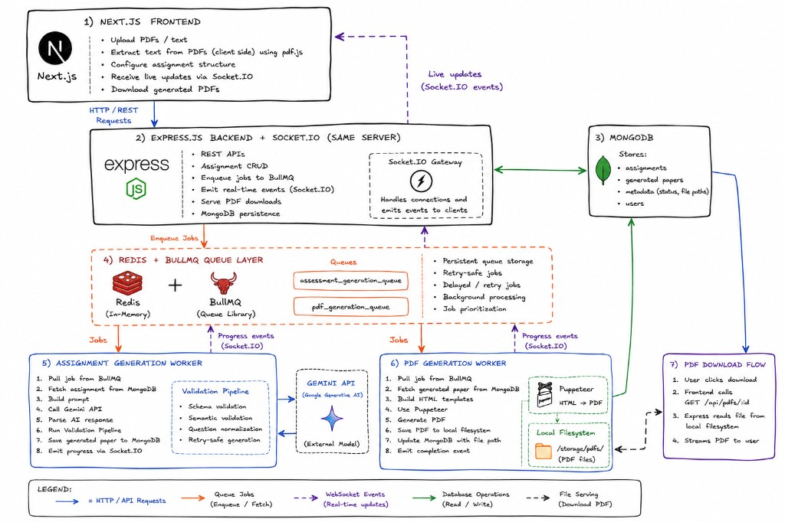
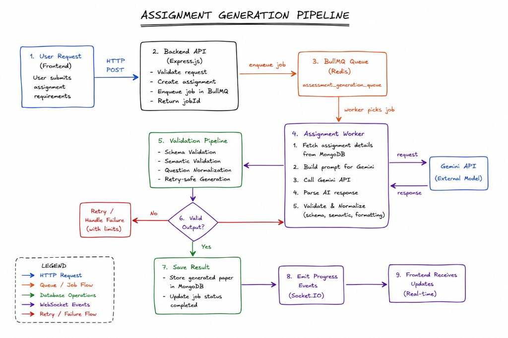
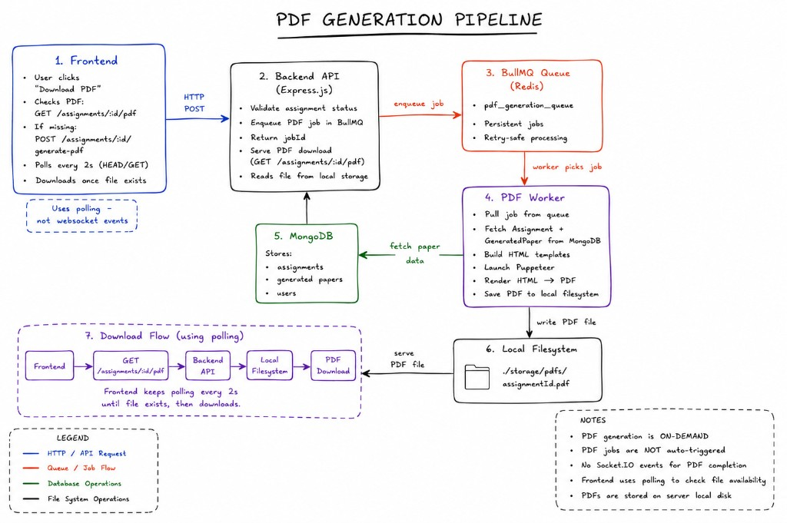

# VedaAI

**AI-powered Question Paper & Assessment Generation Platform**

VedaAI helps educators create structured, exam-ready question papers from syllabus context, teacher instructions, and uploaded reference material. The platform uses a **validation-driven AI pipeline** — LLM output is parsed, normalized, and verified before anything is persisted or shown to users.

Built as a production-oriented full-stack system: **Next.js** frontend, **Express.js** API, **MongoDB**, **Redis + BullMQ** workers, **Socket.IO** realtime updates, and **Puppeteer** PDF rendering — deployed on **Vercel** (frontend) and **Railway** (backend + workers) with a **Dockerized** backend image.

---

## Table of Contents

- [High-Level Architecture](#high-level-architecture)
- [Approach](#approach)
- [Tech Stack](#tech-stack)
- [Frontend Architecture](#frontend-architecture)
- [Backend Architecture](#backend-architecture)
- [Queue & Worker Architecture](#queue--worker-architecture)
- [Assignment Generation Pipeline](#assignment-generation-pipeline)
- [PDF Generation Pipeline](#pdf-generation-pipeline)
- [Real-time Event Flow](#real-time-event-flow)
- [Validation Layer](#validation-layer)
- [Prompt Engineering Strategy](#prompt-engineering-strategy)
- [Design Decisions](#design-decisions)
- [System Flowcharts](#system-flowcharts)
- [Deployment Architecture](#deployment-architecture)
- [Project Structure](#project-structure)
- [Setup Instructions](#setup-instructions)
- [Environment Variables](#environment-variables)

---

## High-Level Architecture

VedaAI separates **interactive request handling** from **long-running AI and PDF work**. The API enqueues jobs, workers process them asynchronously, and progress streams back to the browser over WebSockets.



| Layer | Responsibility |
|--------|----------------|
| **Next.js frontend** | Auth, assignment UX, client PDF extraction (`pdf.js`), Socket.IO client, PDF polling |
| **Express API + Socket.IO** | REST APIs, user/assignment CRUD, job enqueue, WebSocket gateway, PDF download |
| **MongoDB** | Users, assignments, generated papers, metadata |
| **Redis + BullMQ** | Durable job queues (`assessment-generation`, `pdf-generation`) |
| **Workers** | Gemini generation + validation; Puppeteer PDF rendering |
| **Local filesystem** | Generated PDF storage (`./storage/pdfs/`) |

---

## Approach

1. **Never trust raw LLM output** — every generation passes through parse → normalize → Zod schema validation → semantic/coherence rules before storage.
2. **Async by default** — paper generation and PDF rendering run in BullMQ workers so API threads stay responsive.
3. **Realtime UX** — generation progress is pushed via Redis pub/sub → Socket.IO; PDF readiness uses HTTP polling (no PDF WebSocket events).
4. **Section-aware papers** — one question type per section, aligned to teacher blueprints and marks distribution.
5. **Retry-safe generation** — validation failures trigger BullMQ retries (up to 3 attempts with exponential backoff) before marking an assignment failed.
6. **Operational clarity** — Docker image includes Chromium for Puppeteer; frontend and backend deploy independently.

---

## Tech Stack

| Area | Technologies |
|------|----------------|
| Frontend | Next.js 16, React 19, TypeScript, Tailwind CSS, NextAuth (Google), Zustand, Socket.IO client, Axios |
| Backend | Express 5, TypeScript, Zod, Mongoose, BullMQ, Socket.IO, Pino |
| AI | Google Gemini (`responseMimeType: application/json`) |
| Data | MongoDB, Redis |
| PDF | Puppeteer + HTML templates |
| Auth | NextAuth + backend user sync (`POST /api/users/sync`) |
| Hosting | Vercel (frontend), Railway (API/workers), Docker (backend) |

---

## Frontend Architecture

```
┌─────────────────────────────────────────────────────────────┐
│  Next.js App Router                                         │
│  ├── Public landing + Google OAuth (/login)                 │
│  ├── Protected dashboard (/home, /assignments/*)            │
│  │     middleware.ts → NextAuth session gate                │
│  └── AuthApiProvider → injects X-User-Id on API calls       │
└─────────────────────────────────────────────────────────────┘
         │ REST (Axios)                    │ Socket.IO
         ▼                                 ▼
    Express /api/*                    Live generation events
```

- **Route protection**: NextAuth middleware guards `/home` and `/assignments/*`.
- **State**: Zustand stores for assignment lists and generation progress; hooks sync with API + sockets.
- **Create flow**: Multi-step form with optional PDF upload; client-side text extraction feeds `uploadedContent`.
- **Generating view**: Subscribes to assignment rooms; polls API as fallback if socket events are missed.
- **PDF UX**: On-demand `POST …/generate-pdf`, then polls `HEAD`/`GET …/pdf` until the file exists.

---

## Backend Architecture

```
Client ──HTTP──► Express Router (/api)
                    ├── requireUser (X-User-Id + MongoDB user lookup)
                    ├── Zod request validation
                    ├── Assignment service (ownership checks)
                    └── Enqueue BullMQ jobs

Worker process (separate Node entry: worker.ts)
                    ├── assessment-generation worker
                    └── pdf-generation worker

API server (server.ts)
                    ├── Socket.IO on same HTTP server
                    └── Redis subscriber → dispatch to rooms
```

Key modules:

| Path | Role |
|------|------|
| `services/ai/` | Prompt building, Gemini calls, parsing, normalization |
| `api/validators/schemas/` | Zod + semantic rules for questions/sections/papers |
| `services/generation/` | Orchestration, progress events, persistence |
| `workers/` | BullMQ consumers |
| `services/websocket/` | Socket rooms, Redis pub/sub bridge |

---

## Queue & Worker Architecture

```
API ──enqueue──► Redis (BullMQ)
                    │
        ┌───────────┴───────────┐
        ▼                       ▼
 assessment-generation    pdf-generation
        │                       │
        ▼                       ▼
 Assessment Worker          PDF Worker
 (Gemini + validation)      (Puppeteer + FS)
```

- **Queues**: `assessment-generation`, `pdf-generation`
- **Job options**: 3 attempts, exponential backoff (2s base), bounded job history retention
- **Idempotency**: Assessment jobs use `jobId: assessment-{assignmentId}` to avoid duplicate enqueues
- **Concurrency**: Assessment worker concurrency = 2
- **Processes**: Run API (`npm run dev` / `start`) and workers (`npm run worker`) separately — or `npm run start:all` in backend

### Queue–worker flow (text)

```
POST /assignments
    → save assignment (pending)
    → queue.add('generate', { assignmentId })
    → return assignmentId immediately

Worker picks job
    → processAssessmentGeneration()
    → on validation/AI error + retries left → throw (BullMQ retry)
    → on final failure → status failed + generation_failed event
```

---

## Assignment Generation Pipeline



1. Teacher submits assignment configuration (+ optional extracted PDF text).
2. API validates input, creates MongoDB record, enqueues generation job.
3. Worker loads assignment, builds modular Gemini prompt, calls model with JSON mode.
4. Raw response → **validation pipeline** (see below).
5. Normalized sections saved to `GeneratedPaper`; assignment marked `completed`.
6. Progress events emitted throughout (started → progress → completed/failed).

---

## Real-time Event Flow

```
Worker/API  ──publish──►  Redis channel (vedaai:generation-events)
                              │
                              ▼
                    API Socket.IO subscriber
                              │
                              ▼
              room: assignment:{assignmentId}
                              │
                              ▼
                    Browser (subscribe:assignment)
```

| Client → Server | Server → Client |
|-----------------|-----------------|
| `subscribe:assignment` | `generation_started` |
| `unsubscribe:assignment` | `generation_progress` |
| | `generation_completed` |
| | `generation_failed` |

Subscribe ack may replay cached state for reconnects and late joiners.

---

## Validation Layer

> **Core principle:** VedaAI uses a **validation-first AI generation pipeline**. Raw Gemini text is never written to MongoDB.

### Why raw LLM output cannot be trusted

Large language models can return:

- Invalid or fenced JSON
- Wrong shapes (mixed question types in one section)
- Semantically broken items (MCQ stems with blanks, True/False phrased as essays)
- Inconsistent marks, missing answers, or duplicate MCQ options
- Section layouts that ignore the teacher’s blueprint

Serving that output directly would break PDF rendering, confuse students, and erode trust. Validation turns probabilistic generation into **deterministic, storage-safe documents**.

### Validation-first pipeline

```
Gemini raw text
    │
    ▼
stripMarkdownJson() + JSON.parse (with object extraction fallback)
    │
    ▼
normalizeGeneratedPaperPayload()   ← structure cleanup
    │
    ▼
Zod schema validation              ← schema + per-question rules
    │
    ▼
validatePaperCoherence()           ← cross-section / blueprint rules
    │
    ▼
finalizeSectionsForStorage()       ← MCQ answer-key normalization
    │
    ▼
MongoDB (GeneratedPaper)
```

### 1. Schema validation (Zod)

- **`generatedPaperOutputSchema`** — paper must contain ≥1 section; each section has title, instruction, questions.
- **`questionSchema`** — per-type fields (MCQ options count, required answers, difficulty enum, marks).
- **`regeneratedSectionOutputSchema`** — single-section regeneration path.

Enforced with `safeParse`; failures throw `AiParseError` with structured issue paths.

### 2. Semantic validation

Type-aware rules in `question-semantics.validation.ts`, e.g.:

- MCQ must not use fill-in-the-blank phrasing or placeholders
- True/False must not include option arrays or essay-style prompts
- Fill-blank must include `___` placeholders and no MCQ options
- Short/long must not carry MCQ-style options

### 3. Structure validation

- **Section homogeneity** — exactly one `type` per section
- **Title/type alignment** — inferred section format must match question types
- **Blueprint coherence** — section count and per-section types must match `questionBlueprint` when provided
- **Answer rules** — type-specific answer formats, MCQ `correctAnswer` must match an option

### 4. Duplicate & collision controls

| Mechanism | What it prevents |
|-----------|------------------|
| **MCQ option uniqueness** | Duplicate choices within a question |
| **Section regeneration context** | Re-generated section duplicating other sections’ content (prompt-level isolation) |
| **BullMQ `jobId`** | Duplicate generation jobs for the same assignment |
| **Text normalization** | Repeated “Prompt 1 / Section A” prefixes polluting question stems |

### 5. Automatic regeneration on failure

- Parser/validation errors → `AiParseError` / `AiGenerationError`
- BullMQ **retries up to 3 times** (exponential backoff)
- Worker emits progress: *“Adjusting questions and retrying (n/3)…”*
- After final attempt → assignment `failed`, `generation_failed` event to client
- **Section regeneration** (user-triggered) runs the same validate-then-save path for a single section

### Production safety outcomes

| Without validation | With validation |
|--------------------|-----------------|
| Broken JSON crashes UI | Parse errors caught; retry or fail gracefully |
| Mixed-type sections | Homogeneity + blueprint rules reject |
| Unusable MCQ/T-F items | Semantic guards per question type |
| Silent data corruption | Only `validation.data` persisted |

---

## PDF Generation Pipeline



PDFs are **on-demand**, not automatic after paper creation.

1. User clicks download → frontend checks `GET /assignments/:id/pdf`.
2. If missing → `POST /assignments/:id/generate-pdf` enqueues `pdf-generation` job.
3. PDF worker fetches assignment + paper from MongoDB, renders HTML, runs Puppeteer, writes `./storage/pdfs/{assignmentId}.pdf`.
4. Frontend polls every ~2s until file exists, then downloads via authenticated GET.

> **Note:** PDF completion does not use Socket.IO — polling keeps the flow simple and reliable across deploy topologies.

---

## Prompt Engineering Strategy

Prompts are **modular strings** composed in `promptBuilder.ts` from shared rule modules — not monolithic blobs. This keeps assessment and regeneration flows consistent and testable.

### Prompt types used

| Type | Purpose | Location |
|------|---------|----------|
| **System-style role prompt** | Sets expert persona (“expert assessment creator”) | `buildAssessmentPrompt`, `buildRegenerateSectionPrompt` |
| **Structured assignment prompt** | Injects title, subject, marks, blueprint, reference material | `buildAssessmentPrompt` |
| **Section-aware contracts** | One section per question type; per-type examples (MCQ, T/F, etc.) | `SECTION_TYPE_CONTRACTS` |
| **Quality / anti-pattern rules** | Academic wording, no “Prompt 1” leakage | `QUESTION_QUALITY_RULES` |
| **Answer-key rules** | Co-generated model answers, MCQ `correctAnswer` | `ANSWER_GENERATION_RULES` |
| **JSON schema examples** | Embedded `MCQ_JSON_EXAMPLE`, `SHORT_ANSWER_JSON_EXAMPLE` | `answerPromptRules.ts` |
| **Regeneration prompt** | Single-section regen with other-section context to avoid overlap | `buildRegenerateSectionPrompt` |
| **Validation-adjacent instructions** | “Return ONLY valid JSON”, allowed enums | End of each builder |

### Design techniques

- **Modularization** — `section-type-rules`, `question-quality-rules`, `answerPromptRules` imported into builders
- **Section-aware prompting** — `formatSectionBlueprintForPrompt()` encodes exact counts, marks, and types per section
- **Schema-constrained prompting** — explicit JSON shape + `responseMimeType: 'application/json'` on Gemini
- **Retry-aware UX** — worker progress messages communicate attempt number; BullMQ handles actual retries
- **Validation-guided regeneration** — regen prompts list existing sections “do not duplicate”
- **Output normalization** — post-parse cleanup of whitespace, marks, MCQ letter answers, prompt prefixes (`question-normalizer.ts`)
- **Reference truncation** — uploaded content capped (~12k chars) for token safety

### Prompt structure (assessment generation)

```text
[Role]
You are an expert assessment creator…

[Assignment context]
TITLE, SUBJECT, DUE DATE, NUM QUESTIONS, TOTAL MARKS, TYPES, INSTRUCTIONS

[Reference material]
EXTRACTED REFERENCE MATERIAL (truncated if long)

[Requirements]
Numbered rules: sections, marks, difficulty mix, blueprint adherence

[SECTION BLUEPRINT]
Per-type section lines (counts + marks)

[SECTION_TYPE_CONTRACTS]
Per-type MCQ / T-F / fill-blank / short / long rules + BAD/GOOD examples

[QUESTION_QUALITY_RULES]
Academic quality + anti-patterns

[ANSWER_GENERATION_RULES]
Model answers + MCQ correctAnswer rules

[JSON template]
Exact sections[] shape + examples

[Closure]
Return ONLY valid JSON.
```

### Prompt structure (section regeneration)

```text
[Role + regen scope]
Regenerate ONLY section "{title}"

[Assignment context]
Same core fields + reference material

[Other sections summary]
List of existing sections (avoid duplication)

[Requirements]
Type constraint, marks, homogeneity

[Shared rule modules]
SECTION_TYPE_CONTRACTS + QUALITY + ANSWER rules

[Single-section JSON template]

[Closure]
Return ONLY valid JSON.
```

---

## Design Decisions

| Decision | Rationale |
|----------|-----------|
| Validation before persistence | LLMs are non-deterministic; schema + semantics ensure exam integrity |
| BullMQ over in-process jobs | Survives restarts, retries, horizontal worker scaling |
| Socket.IO for generation only | Realtime where UX matters; PDF uses polling to reduce complexity |
| Separate worker process | CPU-heavy Gemini + Chromium isolated from API latency |
| `X-User-Id` header from session | Simple BFF-style identity for SPA; sync secret protects user provisioning |
| One section per question type | Matches real exam papers and simplifies validation |
| Docker + Chromium | Reproducible PDF rendering in Railway/production |
| JSON-mode Gemini | Reduces formatting errors; still fully validated |

---

## System Flowcharts

### Request flow (create assignment)

```
Teacher → Next.js form → POST /api/assignments (+ X-User-Id)
    → Express validate body (Zod)
    → MongoDB: create assignment (pending)
    → BullMQ enqueue assessment-{id}
    → 201 + assignmentId
    → Client navigates to /assignments/{id}/generating
    → Socket subscribe + progress UI
```

### Generation + validation flow

```
Worker job
    → load assignment
    → buildAssessmentPrompt()
    → Gemini.generateContent (JSON)
    → parseGeneratedPaperResponse()
         ├─ normalize
         ├─ Zod safeParse
         └─ validatePaperCoherence(blueprint)
    → finalizeSectionsForStorage()
    → save GeneratedPaper
    → emit generation_completed
```

### Validation failure / retry flow

```
parse/validate throws AiParseError
    → attempt < 3 ?
         yes → emit progress "retrying…" → BullMQ retry
         no  → assignment.status = failed
             → emit generation_failed
```

---

## Deployment Architecture

```
┌──────────────────┐         ┌─────────────────────────────────────┐
│  Vercel          │  HTTPS  │  Railway                            │
│  Next.js frontend│ ──────► │  Express API + Socket.IO (:3000)    │
│  NextAuth        │         │  Worker process (same image)      │
└──────────────────┘         │  Docker (Node 22 + Chromium)        │
                             └──────────┬──────────────────────────┘
                                        │
                    ┌───────────────────┼───────────────────┐
                    ▼                   ▼                   ▼
              MongoDB Atlas      Redis (Railway/Upstash)   Volume / disk
                                                         (PDF storage)
```

- **Frontend**: Set `NEXT_PUBLIC_API_URL`, `NEXT_PUBLIC_SOCKET_URL`, `AUTH_SECRET`, Google OAuth vars, `AUTH_SYNC_SECRET` (match backend).
- **Backend**: `ENABLE_MONGODB=true`, `ENABLE_REDIS=true`, `GEMINI_API_KEY`, `CLIENT_URL` = Vercel origin, `AUTH_SYNC_SECRET`.
- **Docker**: `apps/backend/Dockerfile` — installs Chromium, `PUPPETEER_EXECUTABLE_PATH=/usr/bin/chromium`, runs `npm run start` (run workers as separate Railway service with `npm run worker`).

---

## Project Structure

```
VedaAI-Monorepo/
├── architecture/                 # System diagrams (referenced below)
├── apps/
│   ├── frontend/                 # Next.js application
│   │   └── src/
│   │       ├── app/              # App Router pages
│   │       ├── auth.ts           # NextAuth config
│   │       ├── components/       # UI + feature modules
│   │       └── lib/api/          # API client + sockets
│   └── backend/                  # Express API + workers
│       └── src/
│           ├── api/              # Routes, controllers, validators
│           ├── services/ai/      # Prompts, Gemini, parser, normalizer
│           ├── services/generation/
│           ├── workers/          # BullMQ consumers
│           └── queues/           # Queue definitions
├── package.json                  # Monorepo dev scripts
└── README.md
```

---

## Setup Instructions

### Prerequisites

- **Node.js** 20+ (22 recommended for backend Docker parity)
- **MongoDB** 6+ (local or Atlas)
- **Redis** 6+ (local or cloud)
- **Google Cloud** OAuth credentials (frontend auth)
- **Gemini API key** (generation)

### 1. Clone and install

```bash
git clone https://github.com/AnirudhS3110/VedaAI-Monorepo.git
cd VedaAI-Monorepo

cd apps/backend && npm install
cd ../frontend && npm install
```

### 2. Backend environment

```bash
cd apps/backend
cp .env.example .env
```

Edit `.env` — minimum for local dev:

```env
NODE_ENV=development
PORT=3000
CLIENT_URL=http://localhost:3001

ENABLE_MONGODB=true
ENABLE_REDIS=true
MONGODB_URI=mongodb://127.0.0.1:27017/vedaai
REDIS_URL=redis://127.0.0.1:6379

GEMINI_API_KEY=your_gemini_key
GEMINI_MODEL=gemini-1.5-flash
AUTH_SYNC_SECRET=your_shared_secret_min_16_chars
```

### 3. Frontend environment

Create `apps/frontend/.env.local`:

```env
AUTH_SECRET=generate_with_openssl_rand_base64_32
GOOGLE_CLIENT_ID=your_google_client_id
GOOGLE_CLIENT_SECRET=your_google_client_secret

NEXT_PUBLIC_API_URL=http://localhost:3000
NEXT_PUBLIC_SOCKET_URL=http://localhost:3000
AUTH_SYNC_SECRET=same_value_as_backend
```

### 4. Start infrastructure

Run MongoDB and Redis locally (Docker example):

```bash
docker run -d --name veda-mongo -p 27017:27017 mongo:7
docker run -d --name veda-redis -p 6379:6379 redis:7-alpine
```

### 5. Run the application

**Terminal A — API**

```bash
cd apps/backend
npm run dev
```

**Terminal B — Workers** (required for generation & PDF)

```bash
cd apps/backend
npm run worker
```

**Terminal C — Frontend**

```bash
cd apps/frontend
npm run dev -- -p 3001
```

Open [http://localhost:3001](http://localhost:3001) → sign in → create an assignment.

### 6. Docker (backend only)

```bash
cd apps/backend
docker build -t vedaai-backend .
docker run -p 3000:3000 --env-file .env vedaai-backend
```

Run a **second container** (or process) with `npm run worker` for background jobs.

### 7. Production builds

```bash
# Backend
cd apps/backend && npm run build && npm start

# Frontend (Vercel runs this automatically)
cd apps/frontend && npm run build && npm start
```

---

## Environment Variables

### Backend (`apps/backend/.env`)

| Variable | Required | Description |
|----------|----------|-------------|
| `PORT` | No | API port (default `3000`) |
| `CLIENT_URL` | Yes (prod) | Frontend origin for CORS + Socket.IO |
| `ENABLE_MONGODB` | Yes | `true` to connect MongoDB |
| `ENABLE_REDIS` | Yes | `true` to enable queues |
| `MONGODB_URI` | Yes | Mongo connection string |
| `REDIS_URL` | Yes | Redis connection string |
| `GEMINI_API_KEY` | Yes | Google Gemini API key |
| `GEMINI_MODEL` | No | Model id (default `gemini-1.5-flash`) |
| `PDF_OUTPUT_DIR` | No | PDF storage path (default `./storage/pdfs`) |
| `AUTH_SYNC_SECRET` | Prod | Protects `POST /api/users/sync` |

### Frontend (`apps/frontend/.env.local`)

| Variable | Required | Description |
|----------|----------|-------------|
| `AUTH_SECRET` | Yes | NextAuth encryption secret |
| `GOOGLE_CLIENT_ID` | Yes | OAuth client id |
| `GOOGLE_CLIENT_SECRET` | Yes | OAuth client secret |
| `NEXT_PUBLIC_API_URL` | Yes | Backend base URL |
| `NEXT_PUBLIC_SOCKET_URL` | No | Socket URL (defaults to API URL) |
| `AUTH_SYNC_SECRET` | Prod | Must match backend |

---

## API Overview

| Method | Endpoint | Description |
|--------|----------|-------------|
| `GET` | `/api/health` | Health check |
| `POST` | `/api/users/sync` | Upsert user after OAuth (sync secret) |
| `POST` | `/api/assignments` | Create assignment + enqueue generation |
| `GET` | `/api/assignments` | List user assignments |
| `GET` | `/api/assignments/:id` | Assignment + generated paper |
| `POST` | `/api/assignments/:id/regenerate-section` | Regenerate one section |
| `POST` | `/api/assignments/:id/generate-pdf` | Enqueue PDF job |
| `GET` | `/api/assignments/:id/pdf` | Download PDF |

---

## Architecture Diagrams

| Diagram | File |
|---------|------|
| Overall system | [`architecture/overall-architecture.png`](./architecture/overall-architecture.png) |
| Assignment generation | [`architecture/assignment-generation-pipeline.png`](./architecture/assignment-generation-pipeline.png) |
| PDF generation | [`architecture/pdf-generation-pipeline.png`](./architecture/pdf-generation-pipeline.png) |

---

## Author

**Anirudh Selvakumar** — built as a production-grade internship / portfolio showcase demonstrating system design, async workers, AI safety patterns, and full-stack delivery.

---

